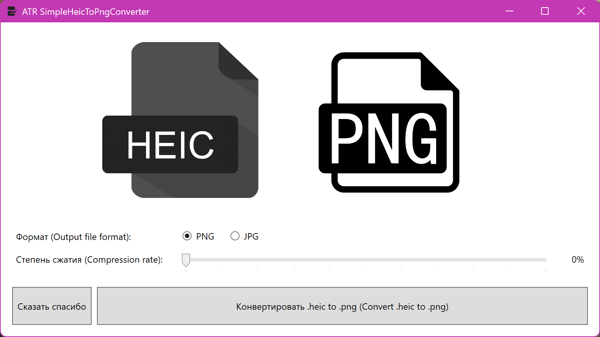

# ATR SimpleHeicToPngConverter

Простой, бесплатный, многопоточный (шустрый) конвертер изображений .heic в .png/.jpg

Использует библиотеку [Magick.NET](https://github.com/dlemstra/Magick.NET) под капотом.
Для запуска необходим .NET 10.0 Desktop Runtime (SKD??)

**Текущая версия:** 2.0

[Скачать](https://github.com/ATRedline/ATR-SimpleHeicToPngConverter/releases/tag/release)

## On English:

Simple, free to use, multithreaded (fast) .heic to .png images converter

Uses [Magick.NET](https://github.com/dlemstra/Magick.NET) lib inside.
Requires .NET 10.0 Desktop Runtime (SDK??) to run.

[Скачать](https://github.com/ATRedline/ATR-SimpleHeicToPngConverter/releases/tag/release)

